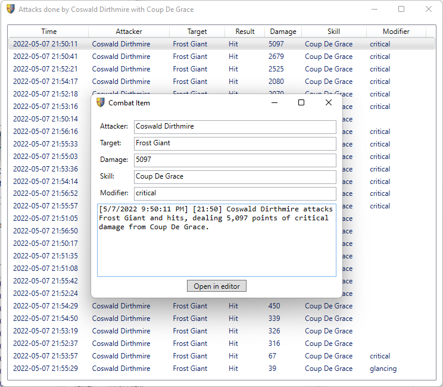

# Sota Utilities

## Log Analyzer

SotA Log Analyzer allows you to load your Shroud of the Avatar log files and analyze them in detail.


### Answers Important Questions

Who took the worst beating?


Who did the most damage?


...down to individual skill uses:



And more.

## External Chat

Have you ever wished you could take that chat window and drag it outside of the game to make use of that second monitor
and/or to free up some screen space in game?

Now you can!


## PlantMaster2000

Tired of calculating your agriculture watering and harvesting times manually? This little tool has you covered:


Copy to clipboard puts a text template in your clipboard that you can paste in a text file to keep track of your various
plant locations:

```
Cotton @ Arlia (Indoors)
    Planted on Monday, 16.05, 08:03
    [ ] Water on Monday, 23.05, 00:03
    [ ] Water on Sunday, 29.05, 16:03
    [ ] Harvest: Sunday, 05.06, 08:03; Harvested amount: 
```
